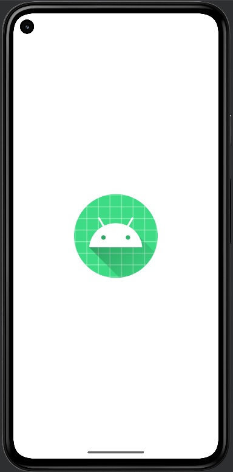
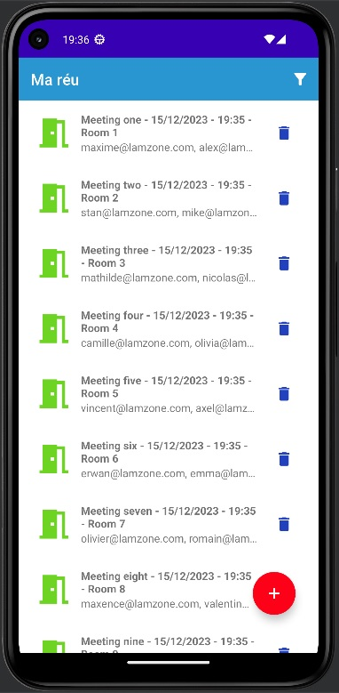
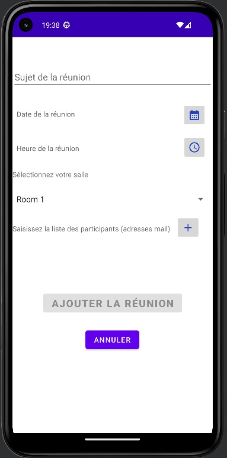
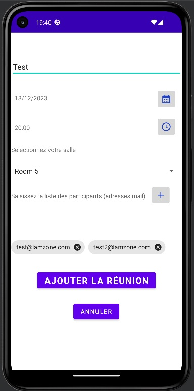
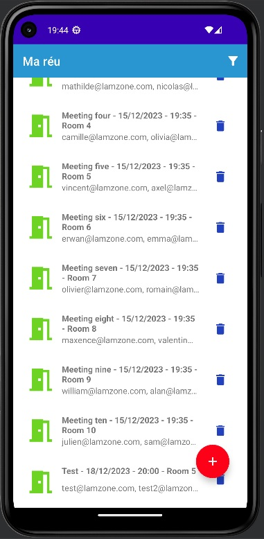
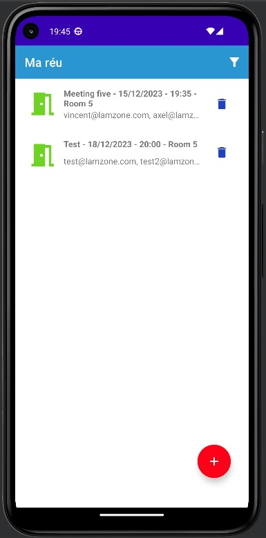
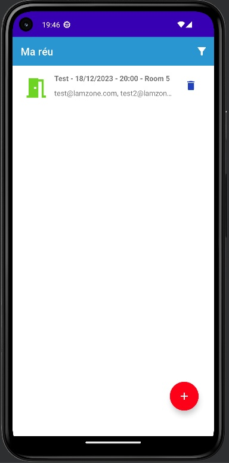

<h1 style="color: steelblue; font-size: 24px;"> <strong> MAREU </strong> </h1>

<h2 style="color: skyblue; font-size: 22px;"> <strong> Description </strong> </h2>

Maréu est une application de gestion de réunions.  
Elle répond au besoin de l'entreprise Lamzone, qui souhaite faire gagner du temps à l'ensemble de ses collaborateurs, dans l'organisation des rencontres en interne. 

<ins> Fonctionnalités </ins> :

➡️ Lister les réunions  
➡️ Ajouter une ou plusieurs réunions  
➡️ Supprimer une ou plusieurs réunions  
➡️ Filtrer les réunions par salle  
➡️ Filtrer les réunions par date  
➡️ Réinitialiser les filtres

Pour information, il s'agit du projet n°4 du parcours de développeur d'applications Android, de la plateforme OPENCLASSROOMS.

<h2 style="color: #37B6FA; font-size: 22px;"> <strong> Prérequis </strong> </h2>

Java JDK : Oracle OpenJDK 17  
Version SDK : 34 / Minimum : 21  
Version Java : 1_8

<h2 style="color: #37B6FA; font-size: 22px;"> <strong> Installation / Compilation / Exécution </strong> </h2>

1. Dans Android Studio, cliquez sur `File` (Fichier) puis `New` (Nouveau) puis `Project from Version Control` (Projet à partir du contrôle de version) et enfin `Git`
2. Copiez-collez l'URL suivante : https://github.com/Galaktik5962/Mareu
3. Choississez le dossier de destination
4. Cliquez sur `Clone` (Cloner)
5. Patientez pendant le téléchargement des fichiers
6. Cliquez sur `OK` pour ouvrir le projet
7. Choississez un émulateur ou connectez votre téléphone
8. Cliquez sur `Run` (Exécuter) pour lancer l'application 

 

Il est aussi possible de passer par <strong> Git Bash </strong> : 

1. Clonez ce repository sur votre ordinateur en utilisant cette commande : git clone https://github.com/Galaktik5962/Mareu
2. Dans Android Studio, cliquez sur `File` (Fichier) puis `Open` (Ouvrir) et sélectionnez le dossier qui correspond au projet cloné
3. Attendez que le projet soit importé dans Android Studio 

 

⚠️ <strong> A noter </strong> : Au lancement d'Android Studio, le projet se compile normalement automatiquement. Si ce n'est pas le cas, cliquez sur le marteau vert dans la barre d'outils en haut à droite de l'écran.

 

 

<h2 style="color: #37B6FA; font-size: 22px;"> <strong> Description </strong> </h2>

Maréu is a meeting management application. It addresses the needs of the company Lamzone, which aims to save time for all its collaborators in organizing internal meetings.

<ins> Features </ins>:

➡️ List meetings  
➡️ Add one or more meetings  
➡️ Delete one or more meetings  
➡️ Filter meetings by room  
➡️ Filter meetings by date  
➡️ Reset filters  

For information, this is project number 4 of the Android application developer course on the OPENCLASSROOMS platform.

<h2 style="color: #37B6FA; font-size: 22px;"> <strong> Prerequisites </strong> </h2>

Java JDK: Oracle OpenJDK 17  
SDK Version: 34 / Minimum: 21  
Java Version: 1_8

<h2 style="color: #37B6FA; font-size: 22px;"> <strong> Installation / Compilation / Execution </strong> </h2>

1. In Android Studio, click on `File` then `New` then `Project from Version Control` and finally `Git`
2. Copy and paste the following URL: https://github.com/Galaktik5962/Mareu
3. Choose the destination folder
4. Click on `Clone`
5. Wait for the files to download
6. Click `OK` to open the project
7. Choose an emulator or connect your phone
8. Click on `Run` to launch the application

 

You can also use <strong> Git Bash </strong>:

1. Clone this repository on your computer using this command: git clone https://github.com/Galaktik5962/Mareu
2. In Android Studio, click on `File` then `Open` and select the folder that corresponds to the cloned project
3. Wait for the project to be imported into Android Studio

 

⚠️ Note: At the launch of Android Studio, the project should be automatically compiled. If it is not the case, click on the green hammer in the top right corner of the screen.

 

 

<h2 style="color: #37B6FA; font-size: 22px;"> <strong> Galerie d'images / Image gallery </strong> </h2>

  
  

  
  
  

